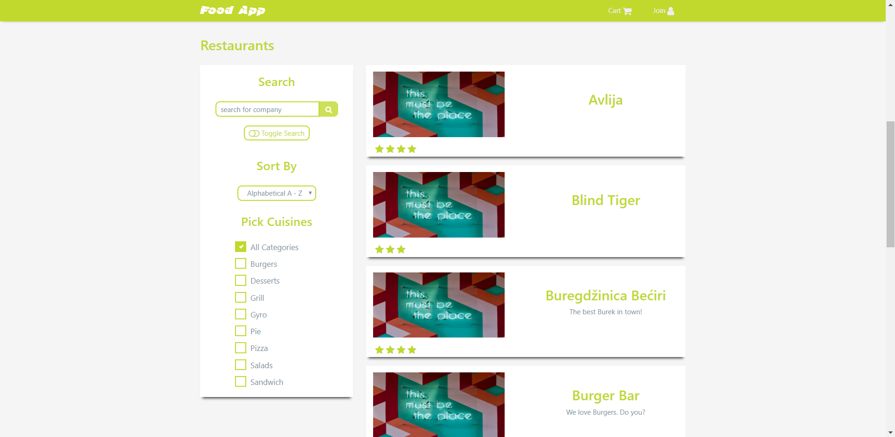
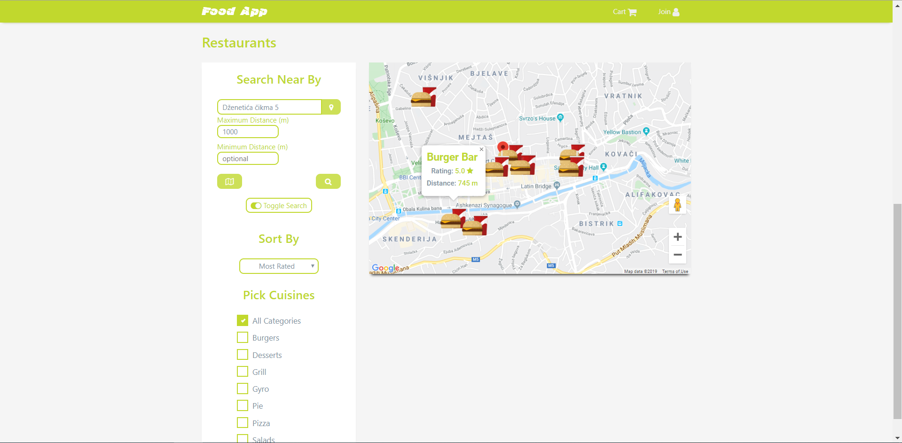
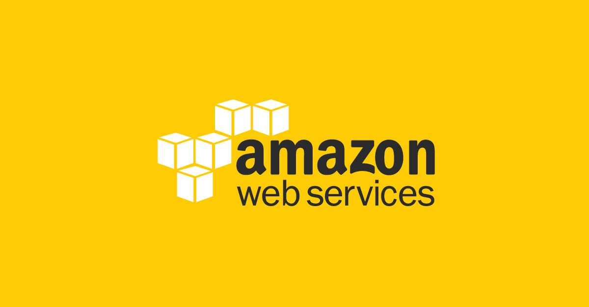
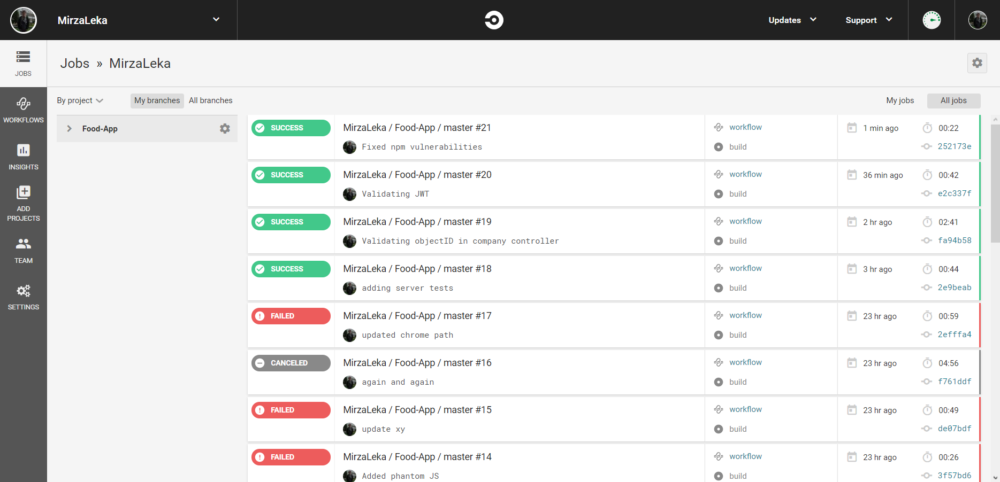
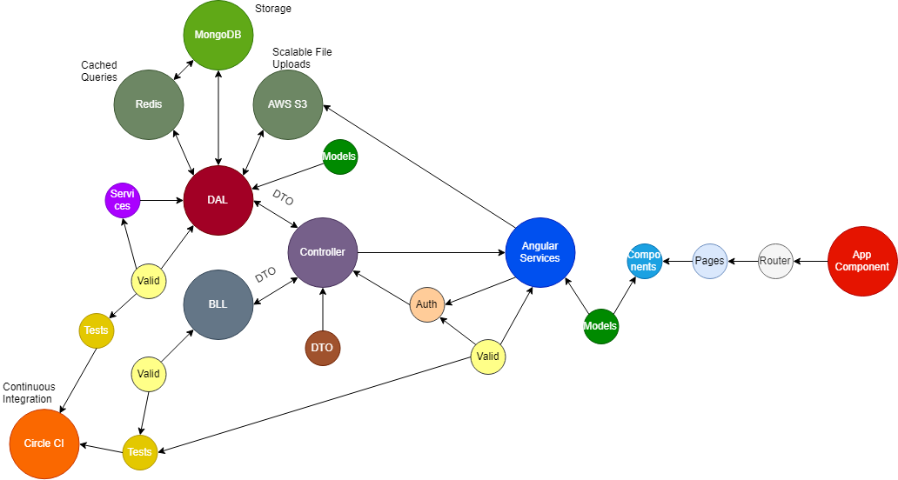

## Food App
Food App is a fictional representation of life like food order App. 


### Key Features
Please keep in mind that this is an early version of the app. That said what you see is not the represenative of the final content and long list of features can only be demonstrated with Postman. 


#### Manipulation

The idea behind **Manipulation** is to give all users a chance to search for restaurants. This means users can search, but also filter and sort restaurants. Since we are not revealing all restaurants at the same time, users can scroll further down the page and paginate through various things on offer.


Then there are **Trending** items. This is a group of random items from one or more restaurants that users can cycle through and make orders without manually searching for these items on the restaurant page.


#### Geolocation Queries

Powered by MongoDB Geolocation queries and combined with several Google APIs, users can search for restaurants that are nearby and take a deeper look with the use of Google Maps.


#### Scalable File Uploads

With combination of Multer and AWS S3, every time new image gets added, it is resized and uploaded directly on AWS S3. This gives us incredible amount of storage with a very simple use.


#### Continious Integration

Leveraging Github webhooks Circle CI runs an automated integration with each new commit. Circle CI gives us an overview of all test cases.


#### Monitoring

Food App is monitored and maintained using PM2 keymetrics. This process manager allows us to detect vulnerabilities before end users see them.


### Stack
Food App is built on popular **MEAN** stack.
```
# Frontend:
- HTML                  - CSS / Sass           - Bootstrap
- Javascript            - EcmaScript6+         - Angular / Rx.js

# Backend: 
- NodeJS                - ExpressJS

# Database:
- MongoDB               - Mongoose             - AWS S3

# Other modules:         
- Validator             - Moment               - Multer      
- JWT                   - BcryptJS             - Axios
- Sharp

# Testing
- Jasmine 

# Third Party APIs
- Google Maps           - Google Autocomplete
- Google Geocode        - Geogle GeoLocation

# Development environment:
- Visual Studio Code    - Postman
- Mlab                  - Robo3T
- Circle CI             - AWS SDK
- PM2
``` 

### Roadmap
Food App is no where near completion. There are so many things we want to add, both from client and technical side and there are also things we need to further polish. We can't tell you what's coming, but what we can do is give you a quick glimpse of what to expect.


Our highest priority is to finish client side and wire up user authentcation. Users will be able to make orders, register, become owners by creating their own restaurants, add, update and remove categories and food items.

From tehnical side, our plan is to redesign the project with ngRx. We also look forward to implement Redis to cache queries and bring information to users even faster.


As you can see, there is a bright future ahead. Please keep in mind this is fan project and development is often pushed aside due to higher priority day-to-day activities. 
Food App is a perfect opportunity for us to expand on our creativity, learn new things and create something amazing.


### Dive in:

```
# Install dependencies
  npm i
  
# Setup config
  Place environment.ts and config.json file in "server/config" folder. 
  Please don't share these files with anyone.

# Run build
  npm run build

# Run Express server (port 3000)
  npm run serv

# Run Angular server (port 4200)
  npm run dev

# Prerequisites: 
  NodeJS must be installed on your pc
```

We're open to all kind of feedback. If you have any suggestions for improvements, please let us know.
